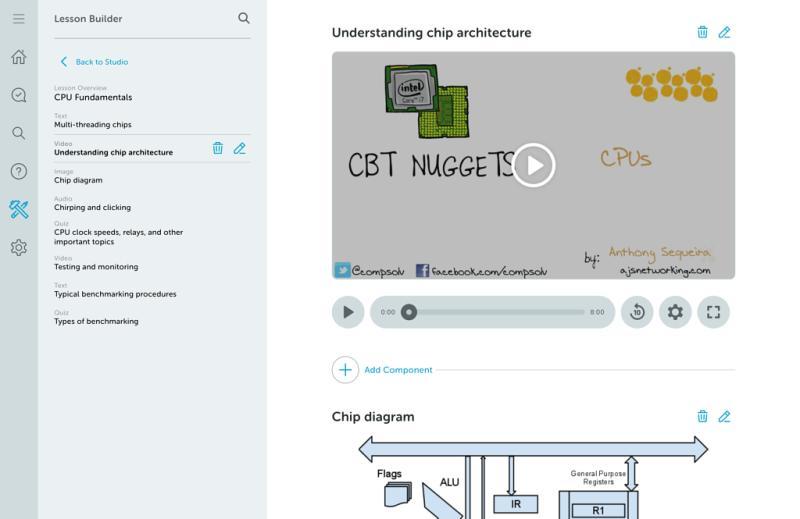

"Absolutely. Here is my [resume](https://www.yvesgurcan.com/resume.pdf) if you want to take a look."

"I had the chance to do a lot more than writing code in my career. For example, I created a prototype when I was working at a company called [CBT Nuggets](https://www.cbtnuggets.com/)."

"I was essentially working on this project on the side after I was done with my regular tasks. The application was called Lesson Builder. I think I have a screenshot somewhere if you want."

He hands you his phone and shows you an image.

"What do you think?"

- ["Did you create the visual design yourself?"](skillbuilder-styles.md)
- ["What kind of language and frameworks did you use?"](skillbuilder-tech.md)
- ["Looks neat. What other projects did you work on in your career?"](project-2.md)
